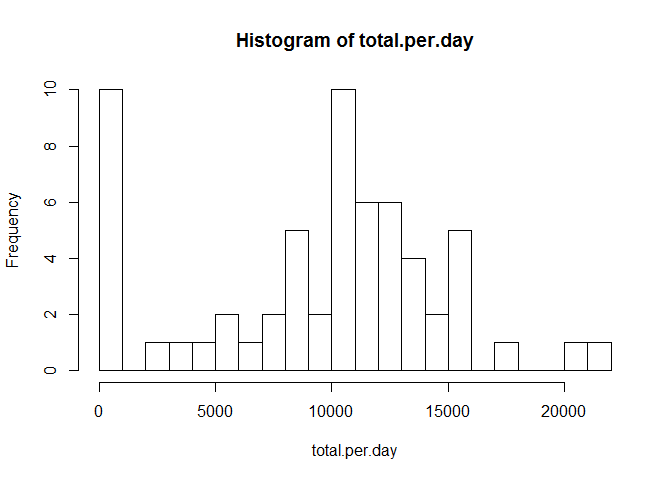
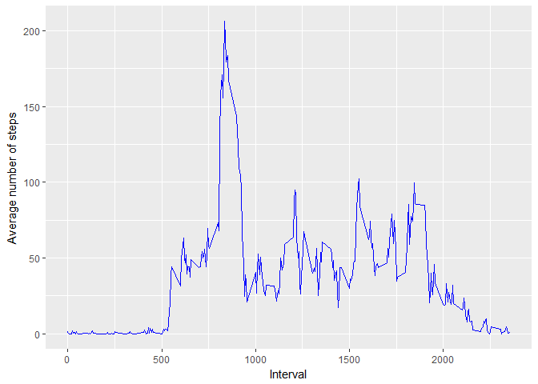
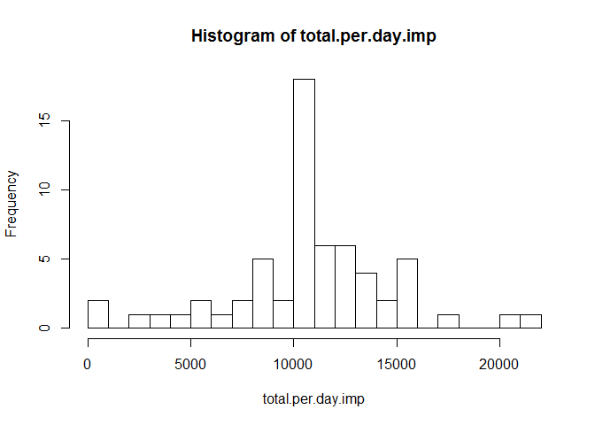
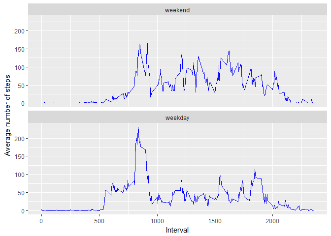

# Reproducible Research: Peer Assessment 1


## Loading and preprocessing the data


```r
dat <- read.csv("activity.csv", header=T)
dat$date <- as.Date(dat$date, format="%Y-%m-%d")
length(unique(dat$date))
```

```
## [1] 61
```

```r
length(unique(dat$interval))
```

```
## [1] 288
```

There are 61 unique dates in the dataset and each date has 288 intervals recorded.

## What is mean total number of steps taken per day?


```r
total.per.day <- tapply(dat$steps, dat$date, FUN=sum, na.rm=T)
hist(total.per.day, breaks=20)
```

<!-- -->

```r
summary(total.per.day)
```

```
##    Min. 1st Qu.  Median    Mean 3rd Qu.    Max. 
##       0    6778   10400    9354   12810   21190
```

The mean number of total steps per day was 9354, and the median was 10400.

## What is the average daily activity pattern?


```r
avg.per.int <- tapply(dat$steps, dat$interval, FUN=mean, na.rm=T)
dat.int <- as.data.frame(cbind(avg.per.int, unique(dat$interval)))
colnames(dat.int) <- c("avg.per.int", "interval")

library(ggplot2)

g <- ggplot(dat.int, aes(interval, avg.per.int))
g <- g+geom_line(color="blue")
g <- g+labs(y="Average number of steps")+labs(x="Interval")
g
```

<!-- -->

```r
dat.int$interval[which.max(dat.int$avg.per.int)]
```

```
## [1] 835
```

On average across all the days in the dataset, the maximum number of steps was in interval 835, or the one recorded at 8:35 am.

## Imputing missing values


```r
table(is.na(dat$steps))
```

```
## 
## FALSE  TRUE 
## 15264  2304
```

```r
# Use mean of each 5 minute interval to impute missing values

dat.imp <- dat

for (i in 1:nrow(dat.imp)) {
        
        if (is.na(dat[i,1])) {int.tmp <- dat$interval[i]
                              dat.imp[i,1] <- dat.int$avg.per.int[which(dat.int$interval==int.tmp)]
                              }
}

total.per.day.imp <- tapply(dat.imp$steps, dat.imp$date, FUN=sum, na.rm=T)
hist(total.per.day.imp, breaks=20)
```

<!-- -->

```r
summary(total.per.day.imp)
```

```
##    Min. 1st Qu.  Median    Mean 3rd Qu.    Max. 
##      41    9819   10770   10770   12810   21190
```

The total number of rows with missing values was 2304.
After imputing the missing values using the average of each 5 minute interval, the mean and median total number of steps taken per day were both 10770. The median remained about the same but the mean was much larger after imputation.
The imputation removed most of the 0's in the calculated daily totals, making the distribution less skewed.

## Are there differences in activity patterns between weekdays and weekends?


```r
dat.imp$weekday <- 1
dat.imp$weekday[(weekdays(dat.imp$date) %in% c("Saturday","Sunday"))] <- 0
dat.imp$weekday <- as.factor(dat.imp$weekday)
levels(dat.imp$weekday) <- c("weekend", "weekday")

avg.wkd <- tapply(dat.imp$steps[dat.imp$weekday=="weekday"], 
                  dat.imp$interval[dat.imp$weekday=="weekday"], FUN=mean, na.rm=T)
dat.wkd <- as.data.frame(cbind(avg.wkd, unique(dat.imp$interval), weekday=1))
colnames(dat.wkd) <- c("avg", "interval", "weekday")

avg.wke <- tapply(dat.imp$steps[dat.imp$weekday=="weekend"], 
                  dat.imp$interval[dat.imp$weekday=="weekend"], FUN=mean, na.rm=T)
dat.wke <- as.data.frame(cbind(avg.wke, unique(dat.imp$interval), weekday=0))
colnames(dat.wke) <- c("avg", "interval", "weekday")

dat.wkd.wke <- rbind(dat.wkd, dat.wke)
dat.wkd.wke$weekday <- as.factor(dat.wkd.wke$weekday)
levels(dat.wkd.wke$weekday) <- c("weekend", "weekday")
dat.wkd.wke$inteval <- as.factor(dat.wkd.wke$interval)

g <- ggplot(dat.wkd.wke, aes(interval, avg))
g <- g+geom_line(color="blue")+facet_wrap(~weekday, dir="v", strip.position="top")
g <- g+labs(y="Average number of steps")+labs(x="Interval")
g
```

<!-- -->

On weekdays, there is an obvious peak above 200 steps at around 8:00 to 8:30 in the morning, probably for commuting from home to work. For the rest of the day, much less steps are usually taken, mostly below 100.
On weekends, the average steps taken spread more evenly through out the day from 8:00 to 20:00, reflecting the fact that activities could possibly happen at all hours on weekends.
